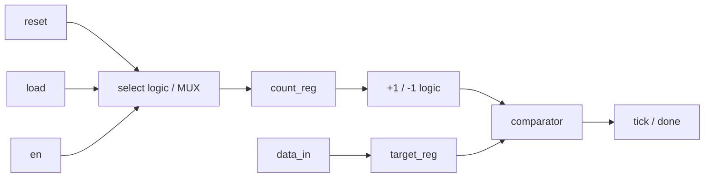
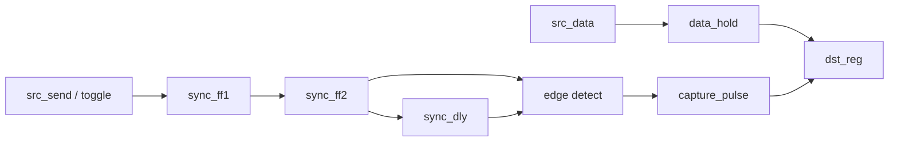
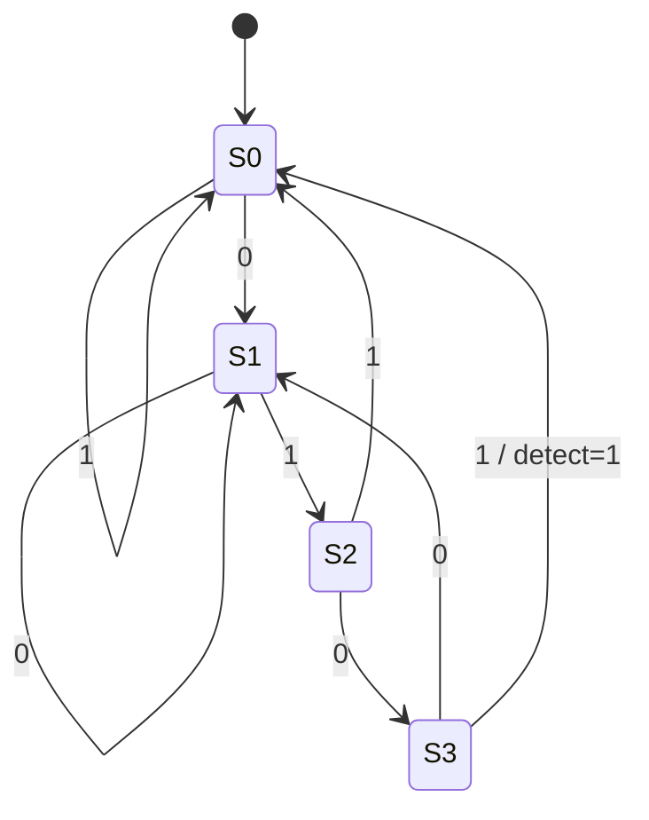
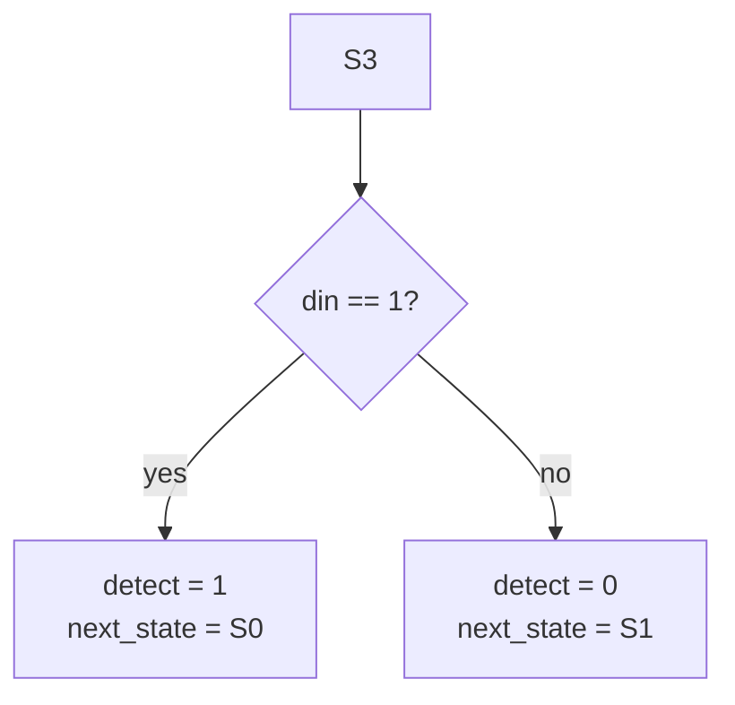

# 논리회로 시험 대비 00 - 최소 필수 요약

> 분류: 2026-04-06부터 2026-05-29까지의 Korcham 수업·시험 범위에 종속된 activity note

목적:
- 현재 시험 대비에서 가장 먼저 고정해야 할 범위를 한 페이지로 묶기
- 자세한 설명은 아래 확장 노트로 보내고, 여기서는 핵심 구조만 붙잡기
- `Counter/Timer`, `Synchronizer / Edge Detector (MCP)`, `0101 non-overlap FSM` 세 축을 중심으로 읽되, 같이 따라오는 `MUX`, `tick generator`, `SIPO/PISO`, `ASM`도 놓치지 않게 하기
- 여기서 `MCP`는 `Multi-Cycle Path`를 뜻함

연결 노트:
- [[activities/korcham/notes/260406-260529-논리회로-시험대비/study-exam-05-counter-timer-counter-register]]
- [[activities/korcham/notes/260406-260529-논리회로-시험대비/study-exam-06-synchronizer-edge-detector-and-0101-non-overlap-fsm]]
- [[activities/korcham/notes/260406-260529-논리회로-시험대비/study-check-01-gate-truth-table-10min-quiz]]
- [[activities/korcham/notes/260406-260529-논리회로-시험대비/study-exam-01-prerequisite-logic-gates-and-symbols]]
- [[activities/korcham/notes/260406-260529-논리회로-시험대비/study-exam-02-gate-to-combinational-logic-bridge]]
- [[activities/korcham/notes/260406-260529-논리회로-시험대비/study-exam-03-combinational-vs-sequential]]
- [[activities/korcham/notes/260406-260529-논리회로-시험대비/study-exam-04-logic-circuit-to-verilog-curriculum]]

## 현재 우선순위

| 우선순위 | 범위 | 시험에서 바로 확인할 것 |
| --- | --- | --- |
| `1` | `Counter/Timer - Counter Register` | `00h` reset, `03h` load, `03 -> 02 -> 01 -> 00`, `done` |
| `2` | `Synchronizer / Edge Detector (MCP)` | `MCP = Multi-Cycle Path`, `data hold -> control/toggle sync -> edge detect -> capture pulse` |
| `3` | `0101 pattern FSM non-overlap` | 상태 정의, 비겹침 전이, `detect` 시점 |

이 세 항목이 현재 시험 대비의 최소 본선이다.

## 이 노트의 역할

- `00`은 시험 직전 마지막 체크용 요약
- 실제 구조와 코드 감각은 `05`, `06`에서 잡아야 함
- `01`, `02`, `03`은 막히는 개념을 다시 메우는 선수개념/보강 노트임
- `04`는 공부 순서와 범위 우선순위를 다시 확인하는 가이드 노트임

## 시험장에서 바로 적어야 하는 것

현재 우선순위 세 항목은 `말로만 설명`하면 부족하다.

- `block diagram`은 ASCII나 Mermaid로 바로 그릴 수 있어야 함
- `FSM / ASM`은 상태, 전이, 출력 위치를 그림으로 적을 수 있어야 함
- `hand writing coding`은 `module`, `input`, `output`, `reg`, `wire`, `assign`까지 같이 적을 수 있어야 함

---

## 1. Counter / Timer / Register

### Counter Register

입력:
- `clk`
- `reset_n`
- `load`
- `data_in[7:0]`
- `en`

동작:
1. `reset_n = 0`이면 `count_reg = 8'h00`
2. `load = 1`이면 `data_in`을 `count_reg`에 저장
3. `en = 1`이면 `count_reg`를 1씩 감소
4. `03h`를 로드했다면 `03 -> 02 -> 01 -> 00`
5. `00h`에 도달하면 `done` 발생

### Timer / Tick Generator

시험에서 자주 같이 붙는 구조는 아래다.

```text
target_reg
-> 몇 클럭 셀지 저장

count_reg
-> 0부터 증가
-> target_reg - 1과 비교
-> 같아지면 tick 1클럭 발생
```

### Block Diagram - ASCII

```text
data_in -----> target_reg --------------------.
                                              |
count_reg --> +1 / -1 logic --> comparator --+--> tick / done
     ^                    |
     |                    v
     '-------- select logic / MUX <--- reset, load, en
```

### Block Diagram - Mermaid



즉 `레지스터가 가리키는 값만큼 카운터해서 tick 발생`은:
- `target_reg`가 목표값 `N`을 저장하고
- `count_reg`가 `0, 1, 2, ..., N-1`까지 세고
- `count_reg == target_reg - 1`일 때 `tick = 1`

### 여기서 MUX를 같이 봐야 하는 이유

counter/timer 안에서는 사실상 아래 중 하나를 고른다.

- reset 값
- load 값
- 감소값 또는 증가값
- 현재값 유지

즉 내부에는 항상 `select logic`, 즉 `MUX 감각`이 들어 있다.

### Hand Writing Coding - Counter / Tick

```verilog
module timer_tick_example (
    input  wire       clk,
    input  wire       reset_n,
    input  wire       load,
    input  wire       en,
    input  wire [7:0] data_in,
    output wire [7:0] count,
    output reg        tick
);

    // 목표 주기를 저장하는 레지스터
    reg [7:0] target_reg;
    // 현재 몇 클럭 셌는지 저장하는 카운터
    reg [7:0] count_reg;

    // 내부 카운터 값을 그대로 외부로 보여줌
    assign count = count_reg;

    always @(posedge clk or negedge reset_n) begin
        if (!reset_n) begin
            target_reg <= 8'h00;
            count_reg  <= 8'h00;
            tick       <= 1'b0;

        end else if (load) begin
            // 새 목표값을 로드하면 카운터를 다시 0부터 시작
            target_reg <= data_in;
            count_reg  <= 8'h00;
            tick       <= 1'b0;

        end else if (en) begin
            // 목표값 직전까지 세고 도달하면 tick을 1클럭 발생
            if (count_reg == target_reg - 8'h01) begin
                count_reg <= 8'h00;
                tick      <= 1'b1;
            end else begin
                count_reg <= count_reg + 8'h01;
                tick      <= 1'b0;
            end

        end else begin
            tick <= 1'b0;
        end
    end

endmodule
```

이 부분은 `HelloVerilog/counter_10000` 수업 코드처럼 보조 `wire`를 두기보다 `if (...)`에서 직접 비교하는 형태로 읽으면 된다.

자세한 확장:
- [[activities/korcham/notes/260406-260529-논리회로-시험대비/study-exam-05-counter-timer-counter-register]]
- [[activities/korcham/notes/260406-260529-논리회로-시험대비/study-exam-02-gate-to-combinational-logic-bridge]]

---

## 2. Synchronizer / Edge Detector (MCP) / SIPO / PISO

### 여기서 MCP는 무엇인가

여기서 `MCP`는 `Model Context Protocol`이 아니라 `Multi-Cycle Path`다.

시험 문맥에서는 아래 구조를 먼저 떠올리면 된다.

- `multi-bit data bus`는 source 쪽 register에 먼저 고정한다
- destination으로는 `1bit control`만 넘긴다
- 그 `control/toggle`만 `2-stage synchronizer`를 탄다
- destination에서 `edge detector`로 `1클럭 capture pulse`를 만든다
- 그 pulse 순간에 destination register가 data bus를 잡는다

핵심은 `data bus` 전체를 비트별로 각각 동기화하는 것이 아니라, `control path`를 동기화하고 `capture 시점`을 만드는 데 있다.

### 왜 edge detector가 필요한가

`MCP`에서 source 쪽 control은 보통 `toggle`로 보낸다.

- source에서 전송 이벤트가 한 번 생길 때마다 `0 -> 1 -> 0 -> 1`처럼 뒤집음
- destination에서는 이 변화가 도착했는지만 알면 됨
- 그래서 `edge detector`가 `변화 검출`을 해서 `1클럭 pulse`로 바꾼다

단일 버튼 입력처럼 `rising edge`만 보면 되는 경우는 `sync_ff2 & ~sync_dly`로 읽어도 되지만, `MCP toggle` 기반이면 `sync_ff2 ^ sync_dly`처럼 `변화 자체`를 잡는 편이 더 정확하다.

시험장에서 헷갈리면 아래처럼 바로 적으면 된다.

- `sync_ff2 & ~sync_dly` = `0 -> 1` 상승엣지만 검출
- `sync_ff2 ^ sync_dly` = `0 -> 1`, `1 -> 0` 둘 다 검출
- `MCP`는 `toggle` 기반이므로 `^`를 써야 모든 전송 이벤트를 놓치지 않음

### Block Diagram - ASCII

```text
src_data
-> data_hold --------------------------------------.
                                                   |
src_send
-> req/toggle -> sync_ff1 -> sync_ff2 -> sync_dly -> edge detect -> capture_pulse
                                                   |
                                                   '-----------------> dst_reg capture
```

### Block Diagram - Mermaid



### Hand Writing Coding - MCP

```verilog
module mcp_sync_edge_example (
    input  wire       src_clk,
    input  wire       src_reset_n,
    input  wire       dst_clk,
    input  wire       dst_reset_n,
    input  wire [7:0] src_data,
    input  wire       src_send,
    output reg  [7:0] dst_data,
    output wire       dst_pulse
);
    // source domain에서 전달할 데이터를 고정해 두는 레지스터
    reg [7:0] data_hold;
    // source domain의 전송 이벤트를 toggle로 변환
    reg       src_toggle;

    // destination domain에서 control만 동기화
    reg sync_ff1;
    reg sync_ff2;
    reg sync_dly;

    // toggle 변화가 보이는 순간 1클럭 capture pulse 생성
    assign dst_pulse = sync_ff2 ^ sync_dly;

    always @(posedge src_clk or negedge src_reset_n) begin
        if (!src_reset_n) begin
            data_hold  <= 8'h00;
            src_toggle <= 1'b0;
        end else if (src_send) begin
            data_hold  <= src_data;
            src_toggle <= ~src_toggle;
        end
    end

    always @(posedge dst_clk or negedge dst_reset_n) begin
        if (!dst_reset_n) begin
            sync_ff1 <= 1'b0;
            sync_ff2 <= 1'b0;
            sync_dly <= 1'b0;
            dst_data <= 8'h00;
        end else begin
            sync_ff1 <= src_toggle;
            sync_ff2 <= sync_ff1;
            sync_dly <= sync_ff2;

            if (dst_pulse)
                dst_data <= data_hold;
        end
    end
endmodule
```

이 구조를 읽을 때는 아래를 같이 적어두는 편이 안전하다.

- source가 `data_hold`를 충분히 오래 유지해야 함
- destination은 `control path`가 동기화된 뒤 `capture pulse`로 bus를 한 번에 잡음
- 최소 시험 구조에서는 `return ack` 없는 `open-loop MCP`를 먼저 이해하면 됨

### SIPO / PISO

둘 다 본질은 `shift register`다.

- `SIPO`: serial in, parallel out
- `PISO`: parallel in, serial out

즉 핵심 질문은:
- 어느 방향으로 미는가
- `load / shift / hold` 중 어떤 조건인가

자세한 확장:
- [[activities/korcham/notes/260406-260529-논리회로-시험대비/study-exam-06-synchronizer-edge-detector-and-0101-non-overlap-fsm]]

---

## 3. FSM / Pattern Detector / ASM

### 0101 Pattern FSM - Non-Overlap

- `S0`: 아무 것도 못 맞춤
- `S1`: `0`
- `S2`: `01`
- `S3`: `010`

가장 중요한 전이:

```text
S3 + din=1 -> detect=1, next_state=S0
```

### FSM - ASCII

```text
S0 --0--> S1
S0 --1--> S0

S1 --0--> S1
S1 --1--> S2

S2 --0--> S3
S2 --1--> S0

S3 --0--> S1
S3 --1 / detect=1 --> S0
```

### FSM - Mermaid



### pattern detector를 일반화하면

패턴 검출은 결국:
- 지금까지 몇 글자 맞췄는지 상태로 저장하고
- 다음 입력 비트에 따라 다음 상태를 정하고
- 완성 시 `detect`를 올리는 FSM이다.

### ASM

`ASM chart`는 아래로 번역하면 된다.

- 상태 박스 -> 상태 동작
- 조건 박스 -> next-state 분기
- 조건부 출력 박스 -> 특정 분기에서만 나가는 출력

### ASM - ASCII

```text
[S3]
  |
  v
<din == 1?>
  |yes                |no
  v                   v
detect = 1           detect = 0
next_state = S0      next_state = S1
```

### ASM - Mermaid



### Hand Writing Coding - FSM / ASM

```verilog
module pattern_0101_non_overlap (
    input  wire clk,
    input  wire reset_n,
    input  wire din,
    output reg  detect
);
    // 현재까지 맞춘 접두 패턴을 상태로 저장
    reg  [1:0] state;
    reg  [1:0] next_state;
    // S3에서 din=1이면 0101 패턴 완성
    wire       is_match;

    // 상태 비트 의미:
    // 2'b00 = S0, 2'b01 = S1, 2'b10 = S2, 2'b11 = S3
    assign is_match = (state == 2'b11) & din;

    // 현재 상태를 클럭마다 업데이트
    always @(posedge clk or negedge reset_n) begin
        if (!reset_n)
            state <= 2'b00;
        else
            state <= next_state;
    end

    // 입력 비트에 따라 다음 상태와 detect를 결정
    always @(*) begin
        next_state = state;
        detect     = 1'b0;

        case (state)
            2'b00: next_state = din ? 2'b00 : 2'b01;
            2'b01: next_state = din ? 2'b10 : 2'b01;
            2'b10: next_state = din ? 2'b00 : 2'b11;
            2'b11: begin
                if (is_match) begin
                    next_state = 2'b00;
                    detect     = 1'b1;
                end else begin
                    next_state = 2'b01;
                end
            end
        endcase
    end
endmodule
```

자세한 확장:
- [[activities/korcham/notes/260406-260529-논리회로-시험대비/study-exam-06-synchronizer-edge-detector-and-0101-non-overlap-fsm]]

---

## 넓히는 순서

1. [[activities/korcham/notes/260406-260529-논리회로-시험대비/study-exam-05-counter-timer-counter-register]]
2. [[activities/korcham/notes/260406-260529-논리회로-시험대비/study-exam-06-synchronizer-edge-detector-and-0101-non-overlap-fsm]]
3. [[activities/korcham/notes/260406-260529-논리회로-시험대비/study-check-01-gate-truth-table-10min-quiz]]
4. `MUX` 감각을 더 분명히 하려면 [[activities/korcham/notes/260406-260529-논리회로-시험대비/study-exam-02-gate-to-combinational-logic-bridge]]
5. `조합/순차`, `tick generator`, `shift register`, `FSM` 분류를 다시 잡으려면 [[activities/korcham/notes/260406-260529-논리회로-시험대비/study-exam-03-combinational-vs-sequential]]
6. 전체 우선순위를 다시 보고 싶으면 [[activities/korcham/notes/260406-260529-논리회로-시험대비/study-exam-04-logic-circuit-to-verilog-curriculum]]

## 한 줄 요약

현재 시험 최소 필수 범위는 `Counter/Timer - Counter Register`, `Synchronizer / Edge Detector (MCP)`, `0101 non-overlap FSM 설계` 세 축으로 잡고, 그 옆에 `MUX`, `tick generator`, `SIPO/PISO`, `ASM`까지 같이 묶어서 읽으면 된다.
