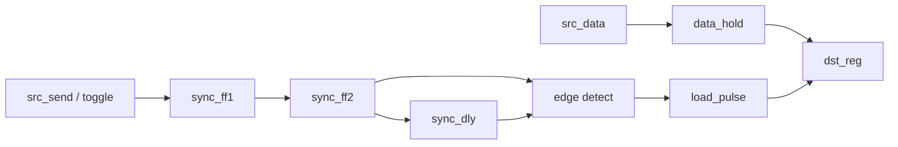

# 논리회로 시험 대비 06 - Synchronizer, Edge Detector (MCP), 0101 Non-Overlap FSM

> 분류: 2026-04-06부터 2026-05-29까지의 Korcham 수업·시험 범위에 종속된 activity note

범위
- `MCP = Multi-Cycle Path`
- `synchronizer`
- `edge detector`
- `SIPO / PISO`
- `FSM`
- `pattern detector`
- `ASM chart`

연결 노트:
- [[activities/korcham/notes/260406-260529-논리회로-시험대비/study-exam-00-core-minimum-summary]]
- [[activities/korcham/notes/260406-260529-논리회로-시험대비/study-exam-04-logic-circuit-to-verilog-curriculum]]
- [[activities/korcham/notes/260406-260529-논리회로-시험대비/study-exam-05-counter-timer-counter-register]]
- [[domains/semiconductor/verilog-hdl/study-11-latch-flip-flop-vivado-checks]]
- [[domains/semiconductor/verilog-hdl/study-12-fsm-diagram-terminology-and-shape-guide]]

## 목표

현재 시험 범위에서 자주 엮여 나오는 순차 블록들을 `MCP -> shift register -> FSM -> ASM` 흐름으로 바로 손코딩 가능한 구조로 고정한다.

1. 여기서 `MCP`가 `Multi-Cycle Path`라는 뜻임을 분명히 하기
2. source와 destination 역할을 구분하기
3. `synchronizer`와 `edge detector`가 `capture pulse`를 만드는 흐름 이해하기
4. `SIPO / PISO`를 `shift register`로 읽기
5. `pattern detector`를 FSM으로 설계하기
6. `ASM chart`를 코드 구조로 번역하기

---

## 1. 여기서 MCP는 무엇인가

여기서 `MCP`는 `Model Context Protocol`이 아니라 `Multi-Cycle Path`다.

시험 문맥에서 말하는 `Synchronizer / Edge detector (MCP)`는 보통 아래 상황을 뜻한다.

- source domain에 `multi-bit data`
- destination domain에 그 데이터를 받아야 하는 register
- `data bus`는 source에서 충분히 오래 유지
- `1bit control`만 동기화해서 destination으로 넘김
- destination에서 `edge detector`로 `1클럭 load pulse`를 만들어 bus를 한 번에 capture

즉 핵심은 `multi-bit data transfer`를 `control path synchronization + destination capture pulse`로 읽는 것이다.

### 가장 중요한 한 줄

`data bus` 전체를 비트별로 각각 synchronizer에 넣는 것이 아니라, `control/toggle`만 동기화하고 destination에서 capture 시점을 만드는 구조다.

---

## 2. MCP에서 Synchronizer / Edge Detector가 하는 일

### 전체 흐름

1. source domain이 `src_data`를 `data_hold`에 저장한다.
2. source domain이 `src_send` 이벤트를 `toggle`로 바꾼다.
3. destination domain은 이 `toggle`만 `2-stage synchronizer`로 받는다.
4. destination domain은 `edge detector`로 `toggle change`를 `1클럭 pulse`로 바꾼다.
5. 그 pulse 순간에 destination register가 `data_hold`를 잡는다.

### ASCII 그림

```text
src_data
-> data_hold --------------------------------------.
                                                   |
src_send
-> req/toggle -> sync_ff1 -> sync_ff2 -> sync_dly -> edge detect -> load_pulse
                                                   |
                                                   '-----------------> dst_reg capture
```

### Mermaid 그림



---

## 3. 왜 이걸 MCP라고 읽어야 하나

`multi-bit bus`를 destination까지 전달하는 동안 핵심은 `bus 값이 안정된 여러 클럭 구간`을 확보하는 것이다.

그래서:

- `data path`는 source에서 먼저 고정
- `control path`만 synchronizer 통과
- destination이 늦게 capture해도 data가 아직 안정돼 있다고 가정

이 `여유 클럭 구간`을 활용하는 관점 때문에 `Multi-Cycle Path`로 읽는다.

최소 시험 답안에서는 아래 두 줄이 중요하다.

- `data`는 source 쪽에서 충분히 오래 유지
- `destination`은 `control sync + edge detect`로 capture 시점만 만든다

---

## 4. Edge Detector는 정확히 무엇을 보나

단일 버튼 입력에서는 보통 `rising edge`만 검출하면 된다.

```verilog
rise_pulse = sync_sig & ~sync_dly;
```

하지만 `MCP`에서는 source가 `toggle`을 뒤집는 방식이 흔하다.

- 첫 번째 전송: `0 -> 1`
- 두 번째 전송: `1 -> 0`
- 세 번째 전송: `0 -> 1`

그래서 destination에서는 `상승엣지 하나`보다 `변화 자체`를 잡는 편이 더 정확하다.

```verilog
capture_pulse = sync_sig ^ sync_dly;
```

즉:
- 단순 버튼 one-pulse면 `& ~`
- `MCP toggle`이면 `^`

왜냐하면 이벤트 정의 자체가 다르기 때문이다.

- 단순 synchronizer + edge detector는 `신호가 1이 되는 순간`이 이벤트
- `MCP toggle`은 `신호값이 바뀌는 순간`이 이벤트

예를 들어 `src_toggle`이 아래처럼 움직이면:

- 첫 번째 전송: `0 -> 1`
- 두 번째 전송: `1 -> 0`
- 세 번째 전송: `0 -> 1`

`& ~`를 쓰면:

- 1번째 전송은 잡힘
- 2번째 전송은 놓침
- 3번째 전송은 다시 잡힘

즉 짝수 번째 전송이 누락된다.

그래서 `MCP`에서는 `rising edge detector`보다 `change detector`, 즉 `sync_sig ^ sync_dly`가 맞다.

---

## 5. 최소 Verilog 골격 - MCP

```verilog
module mcp_sync_edge_example (
    input  wire       src_clk,
    input  wire       src_reset_n,
    input  wire       dst_clk,
    input  wire       dst_reset_n,
    input  wire [7:0] src_data,
    input  wire       src_send,
    output reg  [7:0] dst_data,
    output wire       dst_pulse
);
    reg [7:0] data_hold;
    reg       src_toggle;

    reg sync_ff1;
    reg sync_ff2;
    reg sync_dly;

    assign dst_pulse = sync_ff2 ^ sync_dly;

    always @(posedge src_clk or negedge src_reset_n) begin
        if (!src_reset_n) begin
            data_hold  <= 8'h00;
            src_toggle <= 1'b0;
        end else if (src_send) begin
            data_hold  <= src_data;
            src_toggle <= ~src_toggle;
        end
    end

    always @(posedge dst_clk or negedge dst_reset_n) begin
        if (!dst_reset_n) begin
            sync_ff1 <= 1'b0;
            sync_ff2 <= 1'b0;
            sync_dly <= 1'b0;
            dst_data <= 8'h00;
        end else begin
            sync_ff1 <= src_toggle;
            sync_ff2 <= sync_ff1;
            sync_dly <= sync_ff2;

            if (dst_pulse)
                dst_data <= data_hold;
        end
    end
endmodule
```

### 읽는 포인트

- `data_hold`: source에서 multi-bit data를 먼저 고정
- `src_toggle`: 전송 이벤트를 1bit control로 압축
- `sync_ff1`, `sync_ff2`: control만 destination domain으로 넘김
- `dst_pulse`: 변화 검출 결과
- `dst_data`: pulse 순간에 bus capture

### 시험 답안에서 같이 적어둘 문장

- source는 `data_hold`를 capture가 끝날 때까지 충분히 유지한다고 가정
- 최소 범위에서는 `return ack` 없는 `open-loop MCP`만 이해해도 충분

---

## 6. SIPO / PISO는 결국 Shift Register

### 공통 핵심

`SIPO`와 `PISO`는 별도 마법 블록이 아니라 둘 다 `shift register`다.

핵심 질문은 세 가지다.

1. 새 비트를 어느 쪽에 넣는가
2. 어느 방향으로 미는가
3. `load`, `shift`, `hold` 중 어떤 조건인가

### SIPO

- `serial in`, `parallel out`
- 입력 비트를 한 클럭마다 저장해서 나중에 병렬로 읽는다

```verilog
always @(posedge clk or negedge reset_n) begin
    if (!reset_n)
        shift_reg <= 8'b0;
    else if (shift_en)
        shift_reg <= {shift_reg[6:0], serial_in};
end
```

### PISO

- `parallel in`, `serial out`
- 먼저 병렬 데이터를 `load`
- 이후 클럭마다 한 비트씩 밀어내며 출력

```verilog
always @(posedge clk or negedge reset_n) begin
    if (!reset_n)
        shift_reg <= 8'b0;
    else if (load)
        shift_reg <= parallel_in;
    else if (shift_en)
        shift_reg <= {shift_reg[6:0], 1'b0};
end

assign serial_out = shift_reg[7];
```

### 한 줄 해석

- `SIPO`: 비트를 모아 병렬값을 만든다
- `PISO`: 병렬값을 한 비트씩 내보낸다

---

## 7. FSM의 가장 안전한 읽기법

FSM은 아래 세 덩어리로 읽는 것이 가장 안전하다.

1. `state register`
2. `next-state combinational logic`
3. `output logic`

```text
현재 상태 저장
-> 다음 상태 계산
-> 출력 계산
```

시험장에서 `FSM`이 보이면 먼저 이 3분해를 적는 편이 안전하다.

---

## 8. Pattern Detector는 FSM 문제다

`pattern detector`는 연속된 입력 비트 흐름에서 특정 패턴을 찾는 FSM이다.

즉 아래처럼 생각한다.

```text
현재 입력 한 비트
+ 지금까지 몇 글자 맞췄는지 상태로 저장
-> 다음 상태 결정
-> 패턴 완성 시 출력 1
```

### 설계 순서

1. 패턴 문자열을 정한다
2. 몇 글자까지 맞췄는지 상태를 만든다
3. overlap / non-overlap 여부를 정한다
4. 상태 전이표를 만든다
5. `state / next_state / detect` RTL로 옮긴다

---

## 9. 0101 Pattern FSM - Non-Overlap

### non-overlap 의미

한 번 검출한 패턴 비트를 다음 검출에 겹쳐 재사용하지 않는다.

### 최소 상태 정의

| 상태 | 의미 |
| --- | --- |
| `S0` | 아무 것도 못 맞춤 |
| `S1` | `0`까지 맞춤 |
| `S2` | `01`까지 맞춤 |
| `S3` | `010`까지 맞춤 |

### 상태 전이

| 현재 상태 | 입력 `0` | 입력 `1` |
| --- | --- | --- |
| `S0` | `S1`, `detect=0` | `S0`, `detect=0` |
| `S1` | `S1`, `detect=0` | `S2`, `detect=0` |
| `S2` | `S3`, `detect=0` | `S0`, `detect=0` |
| `S3` | `S1`, `detect=0` | `S0`, `detect=1` |

가장 중요한 줄:

```text
S3 + din=1 -> detect=1, next_state=S0
```

즉 `0101`이 완성되는 순간 검출하고, `non-overlap`이므로 바로 `S0`로 돌아간다.

### 왜 `S3`에서 입력 `0`이면 `S1`인가

현재까지 `010`을 맞춘 상태에서 입력 `0`이 들어오면 문자열은 `0100`이 된다.
맨 끝에 다시 시작 후보 `0`이 남으므로 다음 상태는 `S1`이 자연스럽다.

### 최소 Verilog 골격

```verilog
module pattern_0101_non_overlap (
    input  wire clk,
    input  wire reset_n,
    input  wire din,
    output reg  detect
);
    reg  [1:0] state;
    reg  [1:0] next_state;
    wire       is_match;

    assign is_match = (state == 2'b11) & din;

    always @(posedge clk or negedge reset_n) begin
        if (!reset_n)
            state <= 2'b00;
        else
            state <= next_state;
    end

    always @(*) begin
        next_state = state;
        detect     = 1'b0;

        case (state)
            2'b00: begin
                if (din == 1'b0) next_state = 2'b01;
                else             next_state = 2'b00;
            end
            2'b01: begin
                if (din == 1'b0) next_state = 2'b01;
                else             next_state = 2'b10;
            end
            2'b10: begin
                if (din == 1'b0) next_state = 2'b11;
                else             next_state = 2'b00;
            end
            2'b11: begin
                if (is_match) begin
                    next_state = 2'b00;
                    detect     = 1'b1;
                end else begin
                    next_state = 2'b01;
                end
            end
            default: begin
                next_state = 2'b00;
                detect     = 1'b0;
            end
        endcase
    end
endmodule
```

---

## 10. ASM Chart는 어떻게 읽나

`ASM chart`를 보면 아래 순서로 읽는다.

1. 상태 박스: 그 상태에서 수행하는 동작
2. 조건 박스: 어떤 입력 조건으로 갈라지는가
3. 조건부 출력 박스: 특정 분기에서만 나가는 제어 신호

### 코드로 번역하면

- 상태 박스 -> 상태 기반 동작 / 출력
- 조건 박스 -> next-state logic
- 화살표 -> 상태 전이

즉 ASM은 그림이지만 머릿속에서는 바로 FSM 골격으로 바뀌어야 한다.

### 시험장에서 할 일

1. 상태 이름을 먼저 정한다
2. 각 상태에서 무엇을 하는지 적는다
3. 입력 조건별 다음 상태를 적는다
4. 출력이 상태 의존인지 입력 의존인지 구분한다

---

## 11. 설계 답안 순서

1. 여기서 `MCP`가 `Multi-Cycle Path`라는 점을 먼저 적기
2. `data hold -> control sync -> edge detect -> capture pulse` 흐름 적기
3. `SIPO/PISO`가 `shift register`라는 점 적기
4. 상태 이름과 상태 의미를 적기
5. 전이표 또는 상태도를 적기
6. `ASM chart`가 있으면 상태 박스와 조건 박스를 코드 블록으로 옮기기
7. `state / next_state / output` 골격을 적기

---

## 12. 시험장에서 자주 틀리는 점

1. `MCP`를 단순 버튼 one-pulse 문제처럼만 설명함
2. `data bus`를 비트별로 각각 synchronizer에 넣는다고 적음
3. `toggle` 기반인데도 `rising edge`만 검출한다고 적음
4. `SIPO/PISO`에서 `load / shift / hold` 우선순위를 뒤섞음
5. `pattern detector`에서 overlap / non-overlap을 섞어 씀
6. `ASM chart`의 조건부 출력을 상태 출력으로 잘못 옮김
7. `state`, `next_state`, `output`을 한 블록에 뒤섞음

## 13. 최소 체크리스트

- 여기서 `MCP = Multi-Cycle Path`라고 바로 말할 수 있는가
- `data hold -> control sync -> capture pulse` 흐름을 그릴 수 있는가
- `toggle` 기반이면 `sync_sig ^ sync_dly`로 읽을 수 있는가
- `SIPO/PISO`를 `shift register`로 설명할 수 있는가
- `0101 non-overlap` 상태를 `S0/S1/S2/S3`로 정의할 수 있는가
- `ASM chart`를 `state / decision / conditional output`으로 나눌 수 있는가
